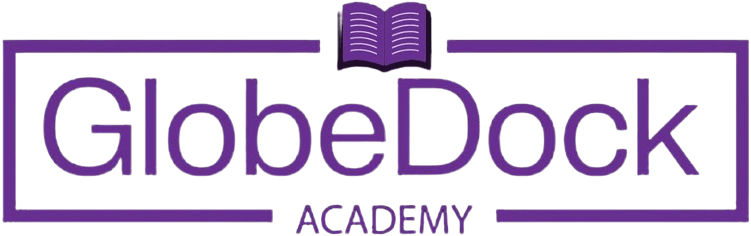

# GlobeDock Academy Website

<p align="center">
  
</p>

Welcome to the official repository for the GlobeDock Academy website! GlobeDock Academy is an innovative online learning platform dedicated to helping students achieve their educational goals through access to top educators and comprehensive learning materials. Millions trust us for their exam preparation and continuous learning journey.

This project is the frontend application for the GlobeDock Academy platform, showcasing its features, offerings, and providing a seamless user experience for prospective and current learners.

## Key Features & Sections

The website includes several key sections to inform and engage users:

*   **Hero Section**: A welcoming introduction to GlobeDock Academy with a primary call-to-action.
*   **Stats Section**: Highlighting key achievements and metrics of the platform.
*   **Why GlobeDock Works**: Explaining the unique value proposition and benefits.
*   **Features Section**: Detailing the core features and tools available to learners.
*   **Download App Section**: Promoting the mobile applications.
*   **Content Types**: Showcasing the variety of learning materials available.
*   **Platform Access**: Information on how to access the platform across devices.
*   **Parent Features**: Specific benefits and features for parents.
*   **Testimonials**: Success stories and feedback from satisfied users.
*   **CTA Section**: A compelling call-to-action to encourage sign-ups.
*   **Contact Us**: Information on how to get in touch with the GlobeDock team.

## Tech Stack

This website is built with a modern technology stack:

*   **Framework**: [Next.js](https://nextjs.org/) ( leveraging App Router)
*   **Language**: [TypeScript](https://www.typescriptlang.org/)
*   **Styling**: [Tailwind CSS](https://tailwindcss.com/)
*   **UI Components**: [ShadCN UI](https://ui.shadcn.com/)
*   **Linting/Formatting**: ESLint & Prettier

## Getting Started

To get a local copy up and running, follow these simple steps.

### Prerequisites

*   Node.js (v18.x or later recommended)
*   npm, yarn, pnpm, or bun

### Installation & Running

1.  Clone the repository:
    ```bash
    git clone https://github.com/mez-vulero/gda-website.git
    ```
2.  Navigate to the project directory:
    ```bash
    cd gda-website
    ```
3.  Install dependencies:
    ```bash
    npm install
    # or
    # yarn install
    # or
    # pnpm install
    # or
    # bun install
    ```
4.  Run the development server:
    ```bash
    npm run dev
    # or
    # yarn dev
    # or
    # pnpm dev
    # or
    # bun dev
    ```

Open [http://localhost:3000](http://localhost:3000) with your browser to see the result.

## Contributing

Contributions are what make the open-source community such an amazing place to learn, inspire, and create. Any contributions you make are **greatly appreciated**.

If you have a suggestion that would make this better, please fork the repo and create a pull request. You can also simply open an issue with the tag "enhancement".

1.  Fork the Project
2.  Create your Feature Branch (`git checkout -b feature/AmazingFeature`)
3.  Commit your Changes (`git commit -m 'Add some AmazingFeature'`)
4.  Push to the Branch (`git push origin feature/AmazingFeature`)
5.  Open a Pull Request

## License

Distributed under the MIT License. See `LICENSE.txt` for more information. (Note: You may need to add a LICENSE.txt file if you intend to specify a license).

## Contact

Your Name/Organization - [your-contact-email@example.com](mailto:your-contact-email@example.com)

Project Link: [https://github.com/mez-vulero/gda-website](https://github.com/mez-vulero/gda-website)
